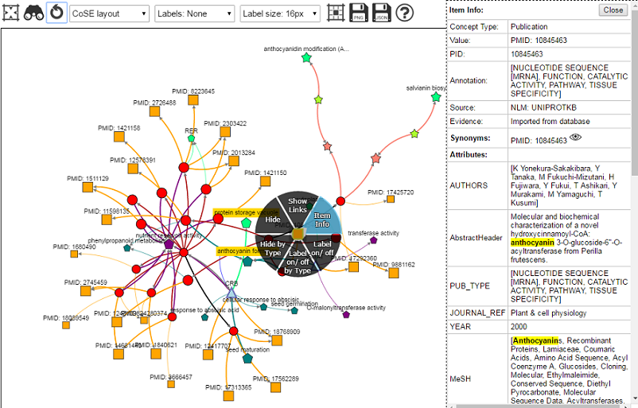

# User Guide

**KnetMaps** uses cytoscapeJS and jQuery for visualizing the heterogeneous knowledge networks. Some of its features are detailed below to help new users get familiarised with it:

* **Concepts** (nodes) are displayed using different labels, shapes and colours (detailed in the legend below the network). **Relations** (edges) too use various colours and labels depending on the type of relation.

* Users can left-click a concept or relation to view some more information about them or drag concepts (click and hold) to move them around. Users can also reposition the entire network by dragging the background viewport.

* **Touch gestures**: KnetMaps can also be used with touch devices. Touch gestures such as tap (click), hold, drag, etc. have been incorporated within KnetMaps to enable interactive exploration of networks.

* **Labels** on concepts and relations are disabled by default. These can however be enabled if the user wants. User’s search query terms in QTLNetMiner, if found in these labels, are _highlighted_ as well.

* **Flagged** concepts: Certain concepts are rendered with a double border to highlight their imporantce. **Note:** In QTLNetMiner, this is used to highlight genes selected for visualization in KnetMaps. 

* Concept sizes and Relation widths can vary based on user's dataset. **Note:** In QTLNetMiner, these sizes depend upon the concept's importance in accordance with the user's original search query terms.

* **Interactive Legend** that only shows those _conceptTypes_ that are present in the currently visualized network. Clicking on a concept icon shows _connected_ concepts of that type which are linked to all visible concepts within the current network.

* **Stats** displayed underneath the network. These are dynamic and change whenever elements (concepts/ relations) are shown/ hidden.

### KnetMaps menubar

The KnetMaps menubar allows users to: 
    1. Change the graph’s **Layout** using force-directed layout algorithms. The layouts supported in the current release of KnetMaps are CoSE (default), circular, nraph-Force, CoSE-Bilkent and Concentric.
    1. **Re-layout** the network.
    1. Export graph data (and visual attributes) as **JSON**.
    1. Export graph as a .png **Image**.
    1. Reset the graph viewport.
    1. Make **labels** visible on concepts and relations, via checkboxes.

### Context menu:

Right-clicking a concept or relation opens a circular context menu with features like **Item Info.** (to display specific information about the selected concept or relation), **Show Links** (to show hidden elements in its neighbourhood), **Hide** (to hide the selected concept or relation), **Hide by Type** (to hide all the concepts or relations of a particular type, i.e., the same type as the selected concept or relation), **Label on/ off** (to toggle the visibility of the Label on/ off for the selected concept or relation) and **Label on/ off by Type** (to toggle the visibility of Labels on/ off for all concepts or relations of a particular Type). 

**Show Links**: Some concepts have a shadow effect which denotes that they have hidden concepts connected to them. These can be displayed by right-clicking on a shadowed concept and selecting “Show Links”. This displays the hidden neighbourhood for the selected concept.

### Item Info

The sliding overlay panel on the right is to display relevant information related to the selected concept or relation. It automatically slides open if users right-click a concept or relation and select “Item Info” option. The panel displays information such as concept/ relation Type, pid, concept value, relation label, relation source (from), relation target (to), _Annotations, Attributes_ (such as publication abstracts, title, authors, amino-acid sequence, TAX ID, etc.) and _Accessions_ (with links to TAIR, Ensembl, UniProtKB, PubMed, KEGG, IPRO, PFAM, etc., where relevant). User’s search query terms, where found, are _highlighted_ in this Item Info. panel.

**Alter concept name**: There are also <i>eye</i> icons next to concept <i>synonyms</i> and <i>accessions</i> in the Item Info. table. Clicking on such an icon updates the concept label in the network with this new label. This is useful in case users want to use their preferred names (from the synonyms or accessions) for concepts.

